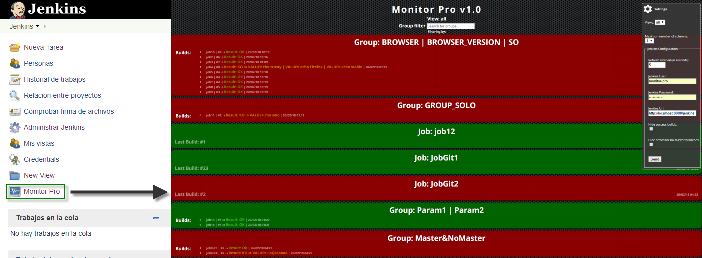

# Monitor Pro Plugin for Jenkins
  Monitor Pro Plugin is a plugin to monitoring the Jobs Executions, built as a SPA application. It provides to Jenkins interface of a button at the main screen. if the user clicks on it, Monitor Pro application will be open.
    
# Features
  In this first version, you can:
  - Select a view.
  - Config the grid maximun number of columns
  - Set polling interval in minutes
  - If exist Jobs, cofigured as a group, that jobs will be shows as a single element in the grid.
  
  
  
# Installation and use
To know how install this plugin, click the next link https://wiki.jenkins-ci.org/display/JENKINS/Plugins#Plugins-Howtoinstallplugins.

Once the plugin's installation has finished, go to the Jenkins main page. An icon has been added at bottom of the left menu. To access the monitor plugin, you must click on it.
 
  

# Technology
  To build the Monitor Pro Plugin, we have used Angular and only use the jenkins plugin technology to deploy it as a jenkins plugin.
  
# Added Value
  This application can be used as a jenkins plugin and also inside any other web application. If your choice is the second option, you must do several configurations to prepare it.
  
# Based on
To start the building of the plugin, we have taken two reference:

- Jenkins EzWall Plugin
- Jenkins CI Build Monitor Plugin

# Licence
The MIT License (MIT)
Copyright (c) 2016 Francisco R Díaz

Permission is hereby granted, free of charge, to any person obtaining a copy of this software and associated documentation files (the "Software"), to deal in the Software without restriction, including without limitation the rights to use, copy, modify, merge, publish, distribute, sublicense, and/or sell copies of the Software, and to permit persons to whom the Software is furnished to do so, subject to the following conditions:

The above copyright notice and this permission notice shall be included in all copies or substantial portions of the Software.

THE SOFTWARE IS PROVIDED "AS IS", WITHOUT WARRANTY OF ANY KIND, EXPRESS OR IMPLIED, INCLUDING BUT NOT LIMITED TO THE WARRANTIES OF MERCHANTABILITY, FITNESS FOR A PARTICULAR PURPOSE AND NONINFRINGEMENT. IN NO EVENT SHALL THE AUTHORS OR COPYRIGHT HOLDERS BE LIABLE FOR ANY CLAIM, DAMAGES OR OTHER LIABILITY, WHETHER IN AN ACTION OF CONTRACT, TORT OR OTHERWISE, ARISING FROM, OUT OF OR IN CONNECTION WITH THE SOFTWARE OR THE USE OR OTHER DEALINGS IN THE SOFTWARE.
